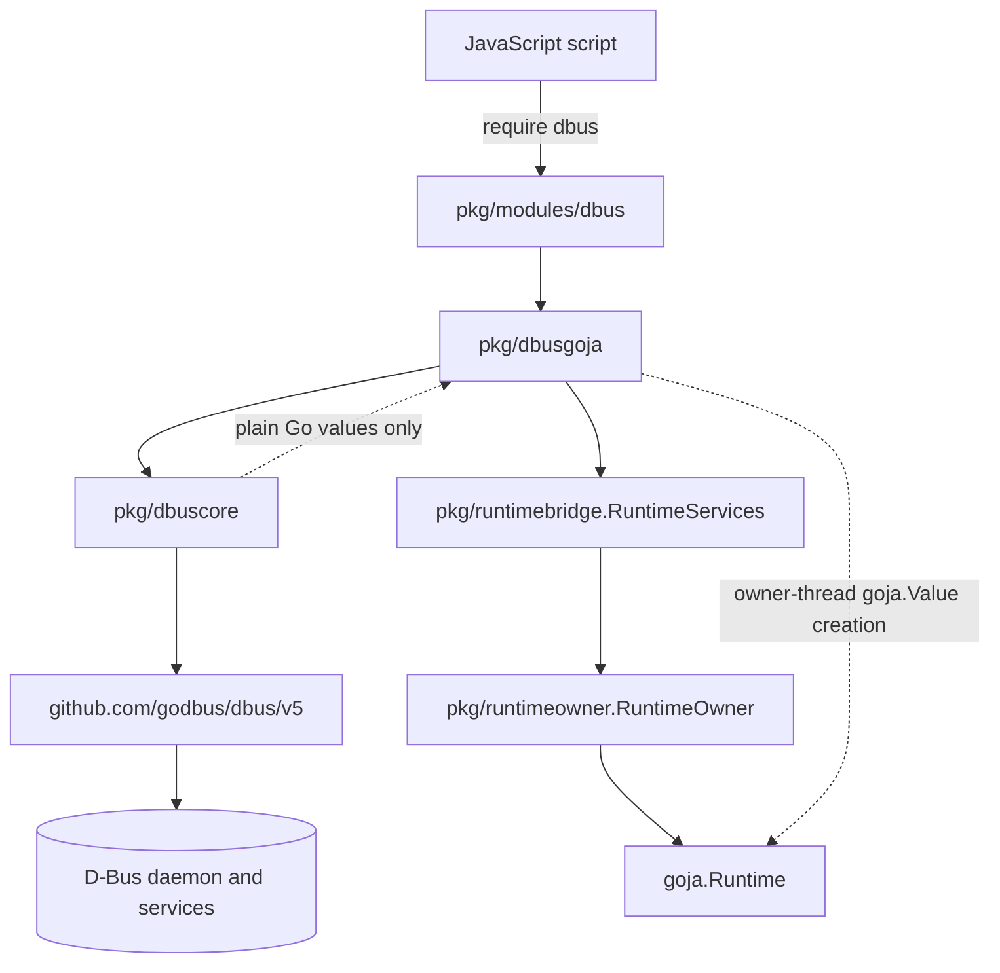
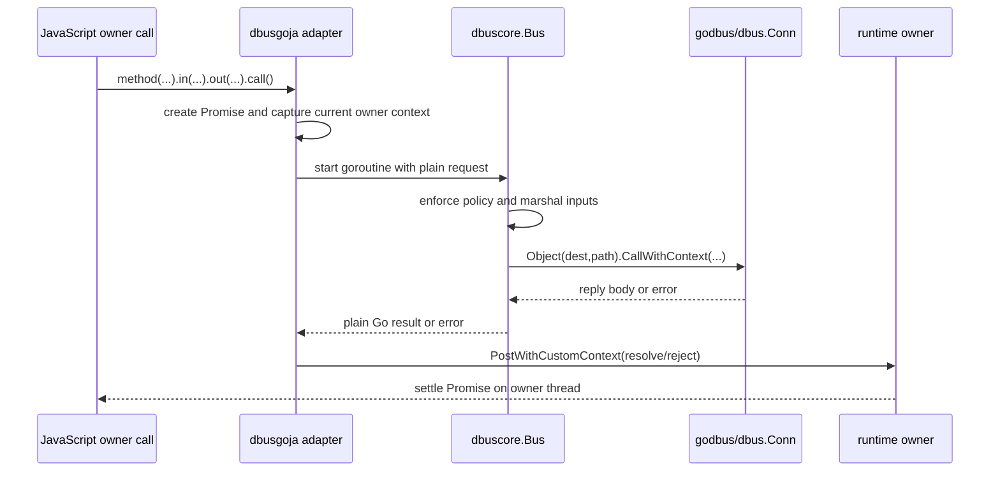
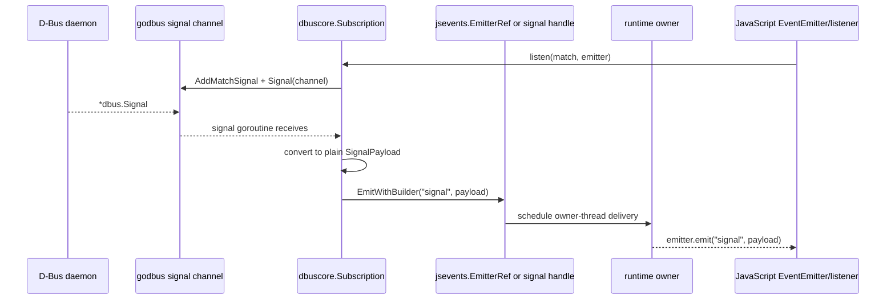
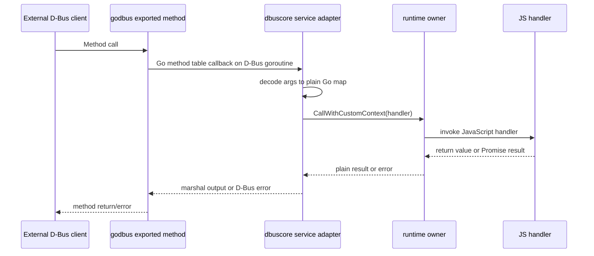

# Goja D-Bus Module Intern Design and Implementation Guide

## Executive summary

This guide explains how to build a `require("dbus")` native module for `go-go-goja`: JavaScript scripts describe what they want to do on D-Bus, and Go performs the actual bus operations, type marshaling, policy enforcement, lifecycle cleanup, and callback scheduling. The design deliberately follows the shape proposed in `sources/01-dbus.md`: **JS defines intent; Go owns execution**. That source states the core split directly: JavaScript should describe bus, destination, object path, interface, signatures, handlers, and lifecycle, while Go enforces policy, marshals D-Bus types, isolates the Goja runtime, and schedules callbacks back onto one JavaScript event loop (`sources/01-dbus.md:1`).

The module should feel idiomatic to JavaScript users but remain strict underneath. Method calls, signal subscriptions, service exports, properties, and object trees are all asynchronous host operations. They should therefore return Promises or closeable handles, never call JavaScript from arbitrary D-Bus goroutines, and never let JavaScript bypass Go-side policy by mutating exposed objects. The most important engineering rule is: **only the runtime owner may touch `goja.Runtime`, `goja.Value`, JavaScript callbacks, or Promise settlement**. The go-go-goja async guide says this explicitly: background goroutines may do blocking Go work, but all JavaScript VM interaction must be scheduled back onto the runtime owner (`go-go-goja/pkg/doc/03-async-patterns.md:18-23`).

The implementation should be staged. Start with a small native module that can connect to the session bus, call `org.freedesktop.DBus.GetId`, and expose explicit scalar type helpers. Then add policy checks, signal listening, service export, properties, introspection, TypeScript declarations, and integration tests. Do not begin with a full D-Bus service framework; first prove the runtime boundary and codec model are correct.

## Problem statement and scope

The `goja-dbus` repository is currently a template project. Its `go.mod` still uses the placeholder module path `github.com/go-go-golems/XXX` (`goja-dbus/go.mod:1`), and the README contains only template ASCII art (`goja-dbus/README.md:1-58`). The ticket goal is not to patch that code immediately, but to give a new intern a clear technical map for turning the template into a real go-go-goja native module.

The target module should allow JavaScript hosted inside go-go-goja to:

- connect to the session bus, system bus, or an explicit bus address;
- call remote D-Bus methods through a fluent builder API;
- receive D-Bus signals safely;
- expose JavaScript-backed D-Bus services, methods, properties, and signals;
- use explicit D-Bus type helpers for ambiguous JavaScript values;
- enforce host-defined policy for bus kind, owned names, called destinations, object paths, and interfaces;
- cleanly close bus connections, signal subscriptions, exported services, and runtime-owned goroutines.

Out of scope for the first implementation phase:

- complete Node.js compatibility;
- automatically generating a full D-Bus API from arbitrary JavaScript objects;
- multi-runtime sharing of Goja object values;
- supporting every obscure D-Bus type before the basic method-call and signal paths are stable;
- implementing an unrestricted system-bus automation surface by default.

## Current-state evidence from go-go-goja

### go-go-goja module model

`go-go-goja` is built around Go-implemented native modules that JavaScript imports via Node-style `require()` calls. The introduction says the runtime bridges Go performance and JavaScript flexibility and keeps Go in control of the module ecosystem (`go-go-goja/pkg/doc/01-introduction.md:18`). Its core concept is a registration system that makes Go functionality available through `require()` (`go-go-goja/pkg/doc/01-introduction.md:20-23`).

The native module contract is small and important:

- implement `modules.NativeModule`;
- provide `Name() string`;
- provide `Doc() string`;
- provide `Loader(*goja.Runtime, *goja.Object)`;
- register the module in `init()`.

The interface itself lives in `go-go-goja/modules/common.go:28-32`. The registry stores modules and enables them in `goja_nodejs/require.Registry` by calling `RegisterNativeModule(m.Name(), m.Loader)` (`go-go-goja/modules/common.go:85-89`). The creating-modules guide shows the basic shape and compile-time interface check (`go-go-goja/pkg/doc/02-creating-modules.md:24-56`).

For `dbus`, this means the first visible Go adapter should look familiar:

```go
package dbusmod

type module struct{}

var _ modules.NativeModule = (*module)(nil)
var _ modules.TypeScriptDeclarer = (*module)(nil)

func (module) Name() string { return "dbus" }
func (module) Doc() string  { return "D-Bus client and service helpers." }
func (module) Loader(vm *goja.Runtime, moduleObj *goja.Object) {
    exports := moduleObj.Get("exports").(*goja.Object)
    // Set exported constructors, helpers, and builder factories here.
}

func init() { modules.Register(&module{}) }
```

### Runtime creation, event loop, and runtime services

The engine factory creates a `goja.Runtime`, starts a `goja_nodejs/eventloop.EventLoop`, creates a `runtimeowner.RuntimeOwner`, and stores runtime services for modules (`go-go-goja/pkg/engine/factory.go:208-234`). It then registers modules with a `require.Registry`, enables require, console, Buffer, URL, performance, and console timers (`go-go-goja/pkg/engine/factory.go:236-270`).

This matters for D-Bus because D-Bus operations naturally involve goroutines and callbacks. The module must not invent its own unsafe runtime access path. It should use `runtimebridge.Lookup(vm)` to retrieve the owner and lifetime context, exactly as the async guide recommends (`go-go-goja/pkg/doc/03-async-patterns.md:24-38`). The runtimebridge API exposes:

- `RuntimeServices.Owner` for serialized VM access;
- `RuntimeServices.Lifetime()` for runtime-owned background work;
- `CallWithCurrentContext` and `PostWithCurrentContext` for work tied to the current JS/native call;
- `CallWithCustomContext` and `PostWithCustomContext` for external request or operation contexts;
- lifetime linking so posted work is cancelled when the runtime shuts down (`go-go-goja/pkg/runtimebridge/runtimebridge.go:24-104`).

### Async and close behavior

A `goja.Runtime` is single-threaded from JavaScript's point of view. The async guide says any operation touching JavaScript values, callbacks, functions, or Promise settlement must run on the runtime owner (`go-go-goja/pkg/doc/03-async-patterns.md:18-23`). It also gives a Promise pattern: create the Promise on owner, perform blocking work in a goroutine, then settle via `runtimeServices.PostWithCustomContext` (`go-go-goja/pkg/doc/03-async-patterns.md:82-121`).

Runtime shutdown is explicit. `engine.Runtime.Close(ctx)` cancels the runtime lifetime, waits briefly for active owner calls, interrupts active JavaScript if needed, runs registered closers, removes runtimebridge services, shuts down the owner, and stops the event loop (`go-go-goja/pkg/doc/03-async-patterns.md:182-186`; implementation at `go-go-goja/pkg/engine/runtime.go:86-127`). A D-Bus module must register closers for bus connections and active subscriptions so shutdown does not leak goroutines or file descriptors.

### Connected EventEmitter pattern

D-Bus signals are long-lived asynchronous events, so the connected-emitter pattern is relevant. The guide explains that Go resources often emit data from background goroutines, but those goroutines cannot touch Goja values directly (`go-go-goja/pkg/doc/17-connected-eventemitters-developer-guide.md:22-29`). The safe pattern is:

- JavaScript creates an `EventEmitter`;
- Go adopts it on the owner thread;
- background goroutines hold an `EmitterRef`;
- background goroutines call `EmitterRef.Emit(...)` or `EmitterRef.EmitWithBuilder(...)`;
- the emitter reference schedules delivery back to the runtime owner;
- a returned connection object closes the Go resource (`go-go-goja/pkg/doc/17-connected-eventemitters-developer-guide.md:30-38`).

The manager code documents that `EmitterRef` is safe to hold from background goroutines, but all emission is scheduled onto the owning runtime (`go-go-goja/pkg/jsevents/manager.go:36-39`). Its `EmitWithBuilder` implementation posts to the owner and builds `goja.Value` payloads only on that owner (`go-go-goja/pkg/jsevents/manager.go:176-202`).

D-Bus can reuse this pattern directly for signals, or it can return its own `SignalSubscription` object with `.on()`/`.close()` and internally use the same scheduling rule. The connected-emitter pattern is simpler to review because listener registration remains owned by JavaScript, while D-Bus match rules and connection cleanup remain owned by Go.

### Runtime composition and sandboxing

`go-go-goja` distinguishes data-only primitives from host-access modules. The Node.js primitives guide says safe globals and data-only modules are installed by default, but host access should be explicit (`go-go-goja/pkg/doc/16-nodejs-primitives.md:20-23`). It also warns that a default builder includes every module in the default registry, including host-access modules, and recommends explicit module middleware for tighter sandboxes (`go-go-goja/pkg/doc/16-nodejs-primitives.md:42-53`).

D-Bus is a host-access module. It can call desktop services, system services, and potentially privileged APIs. Therefore:

- do not treat `dbus` as a data-only primitive;
- expose it only when the embedding application deliberately imports/registers it;
- make policy required or strongly encouraged for system bus access and name ownership;
- default to session-bus-only if a host does not provide explicit options.

## D-Bus concepts the intern must know

D-Bus is an inter-process communication system organized around bus connections, well-known names, object paths, interfaces, members, signatures, method calls, signals, and properties. The `godbus/dbus/v5` package is the Go binding we should use.

### Key terms

- **Bus connection:** A connection to a message bus. Usually this is the session bus for user desktop automation or the system bus for system services.
- **Destination:** The bus name to call, such as `org.freedesktop.DBus` or `org.freedesktop.Notifications`.
- **Object path:** A hierarchical path identifying an object, such as `/org/freedesktop/DBus`.
- **Interface:** A namespace for methods, signals, and properties, such as `org.freedesktop.DBus.Properties`.
- **Member:** A method or signal name within an interface, such as `GetId`, `Notify`, or `PropertiesChanged`.
- **Signature:** A compact type language. Examples: `s` string, `u` uint32, `i` int32, `b` bool, `v` variant, `as` array of strings, `a{sv}` dictionary from string to variant, `(ssss)` struct of four strings.
- **Variant:** A value carrying its own signature, required by many D-Bus APIs such as `a{sv}` property dictionaries.
- **Match rule:** A filter installed on a bus connection to receive signals matching sender, path, interface, member, and sometimes arguments.

### godbus API references

The following APIs are the core building blocks. These references are from `github.com/godbus/dbus/v5` package documentation inspected during this ticket.

- `dbus.SessionBus()`, `dbus.SystemBus()`, `dbus.ConnectSessionBus(...)`, `dbus.ConnectSystemBus(...)`, `dbus.Connect(address, ...)`: create bus connections.
- `(*dbus.Conn).Object(dest string, path dbus.ObjectPath) dbus.BusObject`: create a remote object proxy.
- `(*dbus.Object).CallWithContext(ctx, method string, flags dbus.Flags, args ...any) *dbus.Call`: call a remote method with cancellation.
- `(*dbus.Conn).Signal(ch chan<- *dbus.Signal)`: register a channel for incoming signals.
- `(*dbus.Conn).AddMatchSignal(options ...dbus.MatchOption) error`: install a signal match rule.
- `dbus.WithMatchSender`, `dbus.WithMatchObjectPath`, `dbus.WithMatchInterface`, `dbus.WithMatchMember`: construct signal match options.
- `(*dbus.Conn).RequestName(name string, flags dbus.RequestNameFlags)`: own a well-known service name.
- `(*dbus.Conn).Export`, `ExportWithMap`, `ExportMethodTable`, `ExportSubtree`: expose Go methods as D-Bus service methods.
- `(*dbus.Conn).Emit(path dbus.ObjectPath, name string, values ...any)`: emit a D-Bus signal.
- `dbus.ObjectPath.IsValid()`: validate object paths.
- `dbus.ParseSignature`, `dbus.MakeVariant`, `dbus.MakeVariantWithSignature`: parse signatures and represent variants.
- `github.com/godbus/dbus/v5/prop`: helper package for `org.freedesktop.DBus.Properties`; `prop.Export` creates property support, `prop.Prop` defines property values and change behavior, and `prop.Properties` is safe for concurrent use.
- `github.com/godbus/dbus/v5/introspect`: helper package for D-Bus introspection data and `org.freedesktop.DBus.Introspectable`.

## Proposed JavaScript API

The top-level module should be imported as:

```js
const dbus = require("dbus");
```

The high-level API follows the source design (`sources/01-dbus.md:19-50`):

```js
const bus = await dbus
  .session()
  .timeout(5000)
  .policy({
    allowOwn: ["com.example.*"],
    allowCall: ["org.freedesktop.*", "org.bluez.*"],
    allowSystemBus: false
  })
  .connect();

const id = await bus
  .destination("org.freedesktop.DBus")
  .object("/org/freedesktop/DBus")
  .interface("org.freedesktop.DBus")
  .method("GetId")
  .out("s")
  .call();
```

### Top-level exports

```ts
interface DBusModule {
  session(): BusBuilder;
  system(): BusBuilder;
  connect(address: string): BusBuilder;

  // scalar and compound helpers
  byte(value: number): DBusTypedValue;
  bool(value: boolean): DBusTypedValue;
  i16(value: number): DBusTypedValue;
  u16(value: number): DBusTypedValue;
  i32(value: number): DBusTypedValue;
  u32(value: number): DBusTypedValue;
  i64(value: string | number | bigint): DBusTypedValue;
  u64(value: string | number | bigint): DBusTypedValue;
  double(value: number): DBusTypedValue;
  string(value: string): DBusTypedValue;
  path(value: string): DBusTypedValue;
  signature(value: string): DBusTypedValue;
  variant(signature: string, value: any): DBusTypedValue;
  array(signature: string, values: any[]): DBusTypedValue;
  dict(signature: string, entries: Record<string, any> | Map<any, any>): DBusTypedValue;
  struct(signature: string, values: any[]): DBusTypedValue;
}
```

Type helpers are not optional polish; they solve a real ambiguity. `sources/01-dbus.md` notes that JavaScript has one `Number` while D-Bus distinguishes int32, uint32, int64, double, variant, object path, signatures, arrays, structs, and dictionaries (`sources/01-dbus.md:52-64`). Without helpers, calls such as `Notify(..., 0, ..., 3000)` cannot reliably decide whether `0` is `u`, `i`, `x`, `t`, or `d`.

### BusBuilder

```ts
interface BusBuilder {
  timeout(ms: number): BusBuilder;
  policy(policy: DBusPolicy): BusBuilder;
  name(label: string): BusBuilder;       // optional diagnostic label
  connect(): Promise<DBusBus>;
}
```

The builder is immutable. Each method returns a new builder or a wrapper with copied options. This matters because policy and timeout should be inspectable at call time and should not change underneath an in-flight Promise.

### DBusBus

```ts
interface DBusBus {
  kind: "session" | "system" | "address";
  close(): Promise<void>;
  destination(name: string): RemoteDestination;
  object(path: string): RemoteObject;
  service(name: string): ServiceBuilder;
  signals(): SignalBuilder;
}
```

`DBusBus.close()` should close all runtime-owned D-Bus resources associated with this bus handle. It should be idempotent.

### Remote calls

```ts
interface RemoteDestination {
  object(path: string): RemoteObject;
}

interface RemoteObject {
  interface(name: string): RemoteInterface;
  properties(interfaceName: string): PropertiesClient;
}

interface RemoteInterface {
  method(name: string): MethodCallBuilder;
}

interface MethodCallBuilder {
  in(signature: string, value: any): MethodCallBuilder;
  out(signature: string): MethodCallBuilder;
  timeout(ms: number): MethodCallBuilder;
  noReply(): MethodCallBuilder;
  call(): Promise<any>;
}
```

Properties are convenience wrappers around `org.freedesktop.DBus.Properties`, as recommended by the source (`sources/01-dbus.md:131-159`):

```ts
interface PropertiesClient {
  get(name: string, signature?: string): Promise<any>;
  set(name: string, signature: string, value: any): Promise<void>;
  getAll(): Promise<Record<string, any>>;
}
```

### Signals

The fluent signal API from the source is useful (`sources/01-dbus.md:161-193`):

```ts
interface SignalBuilder {
  sender(name: string): SignalBuilder;
  path(path: string): SignalBuilder;
  pathNamespace(path: string): SignalBuilder;
  interface(name: string): SignalBuilder;
  member(name: string): SignalBuilder;
  arg(index: number, value: string): SignalBuilder;
  decode(signature: string, fn: (body: any[], meta: SignalMeta) => void): SignalBuilder;
  on(fn: (signal: SignalPayload) => void): SignalBuilder;
  listen(): Promise<SignalSubscription>;
}

interface SignalSubscription {
  id: string;
  close(): Promise<void>;
}
```

For the first implementation, prefer an EventEmitter variant because it follows existing go-go-goja patterns:

```js
const EventEmitter = require("events");
const emitter = new EventEmitter();

const sub = await bus.signals()
  .interface("org.freedesktop.DBus.Properties")
  .member("PropertiesChanged")
  .listen(emitter);

emitter.on("signal", (sig) => console.log(sig.path, sig.body));
emitter.on("error", (err) => console.error(err.message));

await sub.close();
```

This shape keeps JavaScript listener registration in JavaScript and lets Go adopt a Go-native emitter safely, matching the connected-emitter model (`go-go-goja/pkg/doc/17-connected-eventemitters-developer-guide.md:30-38`).

### Service export

Service export can follow the source examples for echo, counter, multiple objects, and proxy services (`sources/01-dbus.md:196-355`). The API should be fluent but strict:

```ts
interface ServiceBuilder {
  object(path: string): ObjectBuilder;
  requestNameFlags(flags: NameFlags): ServiceBuilder;
  export(): Promise<ExportedService>;
}

interface ObjectBuilder {
  interface(name: string): InterfaceBuilder;
}

interface InterfaceBuilder {
  method(name: string): MethodExportBuilder;
  property(name: string, signature: string): PropertyExportBuilder;
  signal(name: string): SignalExportBuilder;
}

interface MethodExportBuilder {
  in(signature: string, name: string): MethodExportBuilder;
  out(signature: string, name: string): MethodExportBuilder;
  handle(fn: (args: Record<string, any>, meta: MethodMeta) => any | Promise<any>): InterfaceBuilder;
}

interface ExportedService {
  name: string;
  close(): Promise<void>;
  emit(path: string, interfaceName: string, signalName: string, ...args: any[]): Promise<void>;
}
```

Service callbacks are the hardest part because D-Bus calls arrive on godbus goroutines but JavaScript handlers must run on the runtime owner. The Go service adapter should return D-Bus replies only after the owner-thread JavaScript handler completes or rejects. The implementation must avoid deadlocks: the async guide warns not to block owner-thread flows that wait on goroutines which themselves need owner-thread callbacks (`go-go-goja/pkg/doc/03-async-patterns.md:171-180`).

## Proposed Go package layout

Use the go-go-goja module-authoring pattern: keep domain logic pure, keep goja adapter code focused on conversion and wiring, and keep `modules/dbus/module.go` small.

```text
goja-dbus/
  go.mod
  README.md
  pkg/
    dbuscore/                 # pure Go D-Bus service/client logic; no goja imports
      bus.go
      policy.go
      types.go
      codec.go
      remote.go
      signals.go
      service.go
      properties.go
      introspection.go
      errors.go
    dbusgoja/                 # goja adapter and JS object builders
      module_object.go
      bus_builder.go
      bus_object.go
      remote_builders.go
      signal_builders.go
      service_builders.go
      typed_values.go
      promises.go
      errors.go
      typescript.go
    modules/
      dbus/
        module.go             # NativeModule impl + init() registration only
  cmd/
    goja-dbus-demo/
      main.go                 # optional example runtime/demo CLI
  examples/
    get-id.js
    notify.js
    listen-properties.js
    echo-service.js
```

### Package responsibilities

#### `pkg/dbuscore`

This package should know D-Bus and policy, but not Goja.

Responsibilities:

- open session, system, or address connections;
- wrap `*dbus.Conn` in a `Bus` type with lifecycle tracking;
- validate and apply `Policy`;
- parse and validate D-Bus signatures;
- marshal typed values to Go values accepted by `godbus/dbus/v5`;
- unmarshal reply bodies to plain Go results;
- install and remove signal match rules;
- export services, methods, properties, signals, and introspection data;
- expose close functions for connections, subscriptions, and exported services.

Sketch:

```go
package dbuscore

type BusKind string
const (
    BusSession BusKind = "session"
    BusSystem  BusKind = "system"
    BusAddress BusKind = "address"
)

type ConnectOptions struct {
    Kind    BusKind
    Address string
    Timeout time.Duration
    Policy  Policy
}

type Bus struct {
    conn   *dbus.Conn
    kind   BusKind
    policy Policy
    mu     sync.Mutex
    closed bool
}

func Connect(ctx context.Context, opts ConnectOptions) (*Bus, error)
func (b *Bus) Close(ctx context.Context) error
func (b *Bus) Call(ctx context.Context, req MethodCallRequest) (any, error)
func (b *Bus) Listen(ctx context.Context, req SignalListenRequest, sink SignalSink) (*Subscription, error)
func (b *Bus) Export(ctx context.Context, spec ServiceSpec, dispatcher MethodDispatcher) (*ExportedService, error)
```

#### `pkg/dbusgoja`

This package should know Goja and the `dbuscore` API.

Responsibilities:

- expose JavaScript builders;
- decode lowerCamel JavaScript options into `dbuscore` option structs;
- create Promises;
- schedule Promise settlement through `runtimebridge.RuntimeServices`;
- convert `dbuscore` results into `goja.Value` values on the owner;
- adopt EventEmitters for signals if using connected emitters;
- map Go errors to JavaScript Error objects with stable `.code`, `.name`, and `.details` fields.

Sketch:

```go
package dbusgoja

type ModuleObject struct {
    vm       *goja.Runtime
    services runtimebridge.RuntimeServices
    buses    *BusRegistry
}

func NewModuleObject(vm *goja.Runtime) *ModuleObject
func (m *ModuleObject) Exports() map[string]any

func (m *ModuleObject) Session() *BusBuilder
func (m *ModuleObject) System() *BusBuilder
func (m *ModuleObject) Connect(address string) *BusBuilder
```

#### `pkg/modules/dbus`

This package should be boring. It should only implement `modules.NativeModule`, optionally `modules.TypeScriptDeclarer`, and set exports.

```go
func (m module) Loader(vm *goja.Runtime, moduleObj *goja.Object) {
    exports := moduleObj.Get("exports").(*goja.Object)
    obj := dbusgoja.NewModuleObject(vm)

    modules.SetExport(exports, m.Name(), "session", obj.Session)
    modules.SetExport(exports, m.Name(), "system", obj.System)
    modules.SetExport(exports, m.Name(), "connect", obj.Connect)
    modules.SetExport(exports, m.Name(), "u32", dbusgoja.U32)
    modules.SetExport(exports, m.Name(), "variant", dbusgoja.Variant)
    // ...
}
```

## Architecture diagrams

### Module and runtime ownership



### Method call flow



### Signal flow



### Service export callback flow



## Core data structures and pseudocode

### Policy

Policy must live in Go. JavaScript may request a policy, but it cannot be the authority. The embedding host should be able to set a maximum policy; JavaScript can only narrow it.

```go
type Policy struct {
    AllowSystemBus bool
    AllowSessionBus bool
    AllowAddress []Pattern

    AllowCall []Pattern       // destination/interface/member patterns
    DenyCall  []Pattern
    AllowOwn  []Pattern       // service names allowed for RequestName
    DenyOwn   []Pattern
    AllowPath []Pattern
    DenyPath  []Pattern
}

func (p Policy) CheckConnect(kind BusKind, address string) error
func (p Policy) CheckCall(req MethodCallRequest) error
func (p Policy) CheckOwn(name string) error
func (p Policy) CheckSignalListen(req SignalListenRequest) error
func (p Policy) Intersect(script Policy) Policy
```

Pseudocode:

```text
connect(builder):
  hostPolicy = moduleOptions.Policy
  scriptPolicy = builder.policy
  effective = hostPolicy.intersect(scriptPolicy)
  effective.checkConnect(kind, address)
  open bus
  return DBusBus with effective policy

call(request):
  bus.policy.checkCall(destination, path, interface, member)
  validate object path
  validate interface/member names
  parse input signatures
  marshal JS typed values to dbus-ready Go values
  call godbus with context timeout
  unmarshal reply according to output signature
```

### Typed values and codec

Use a wrapper for values whose D-Bus type cannot be inferred safely.

```go
type TypedValue struct {
    Signature string
    Value     any
}

func U32(v uint32) TypedValue { return TypedValue{Signature: "u", Value: v} }
func I32(v int32) TypedValue  { return TypedValue{Signature: "i", Value: v} }
func Variant(sig string, v any) (TypedValue, error) {
    return TypedValue{Signature: "v", Value: TypedValue{Signature: sig, Value: v}}, nil
}
```

Codec rules:

- Validate every explicit signature with `dbus.ParseSignature`.
- Reject ambiguous JavaScript numbers for 64-bit integer signatures unless passed as string or BigInt-like input.
- Convert `dbus.path("/x")` to `dbus.ObjectPath` and call `.IsValid()`.
- Convert `dbus.signature("a{sv}")` to `dbus.Signature`.
- Convert `dbus.variant(sig, value)` to `dbus.MakeVariantWithSignature(...)`.
- Convert arrays, dictionaries, and structs recursively.
- Keep plain JavaScript objects as dictionaries only when the signature says they are dictionaries.

Pseudocode:

```text
marshal(signature, jsValue):
  sig = parseSignature(signature)
  if jsValue is TypedValue:
    ensure typedValue.signature is compatible with sig
    return typedValue.toDBus()

  switch sig:
    "s": return string(jsValue)
    "b": return bool(jsValue)
    "u": require safe uint32; return uint32(jsValue)
    "i": require safe int32; return int32(jsValue)
    "x": require string/bigint; return int64(parsed)
    "t": require string/bigint; return uint64(parsed)
    "o": return valid dbus.ObjectPath
    "g": return dbus.ParseSignature(jsValue)
    "v": require TypedValue or explicit variant helper
    "aT": return array/map conversion based on T
    "( ... )": return struct conversion in order
    default: error unsupported signature
```

### Promise helper

Use the runtimebridge pattern, not raw `loop.RunOnLoop`, because runtimebridge links contexts to runtime lifetime and centralizes owner scheduling.

```go
func (m *ModuleObject) promise(
    vm *goja.Runtime,
    op string,
    work func(context.Context) (any, error),
    toValue func(*goja.Runtime, any) (goja.Value, error),
) goja.Value {
    promise, resolve, reject := vm.NewPromise()
    callCtx := runtimebridge.CurrentOwnerContext(vm)
    lifetime := m.services.Lifetime()

    go func() {
        ctx, cancel := context.WithCancel(callCtx)
        stop := context.AfterFunc(lifetime, cancel)
        defer func() { _ = stop(); cancel() }()

        result, err := work(ctx)

        _ = m.services.PostWithCustomContext(callCtx, op+".settle", func(_ context.Context, ownerVM *goja.Runtime) {
            if err != nil {
                _ = reject(newJSError(ownerVM, err))
                return
            }
            value, convErr := toValue(ownerVM, result)
            if convErr != nil {
                _ = reject(newJSError(ownerVM, convErr))
                return
            }
            _ = resolve(value)
        })
    }()

    return vm.ToValue(promise)
}
```

### Method call implementation

```go
func (b *Bus) Call(ctx context.Context, req MethodCallRequest) (any, error) {
    if err := b.policy.CheckCall(req); err != nil {
        return nil, err
    }
    if !req.Path.IsValid() {
        return nil, fmt.Errorf("dbus: invalid object path %q", req.Path)
    }

    args := make([]any, 0, len(req.Inputs))
    for _, in := range req.Inputs {
        v, err := Marshal(in.Signature, in.Value)
        if err != nil { return nil, err }
        args = append(args, v)
    }

    if req.Timeout > 0 {
        var cancel context.CancelFunc
        ctx, cancel = context.WithTimeout(ctx, req.Timeout)
        defer cancel()
    }

    obj := b.conn.Object(req.Destination, req.Path)
    call := obj.CallWithContext(ctx, req.Interface+"."+req.Member, 0, args...)
    if call.Err != nil {
        return nil, mapDBusError(call.Err)
    }
    return Unmarshal(req.OutputSignature, call.Body)
}
```

### Signal subscription implementation

```go
func (b *Bus) Listen(ctx context.Context, req SignalListenRequest, sink SignalSink) (*Subscription, error) {
    if err := b.policy.CheckSignalListen(req); err != nil { return nil, err }

    options := req.MatchOptions()
    if err := b.conn.AddMatchSignalContext(ctx, options...); err != nil { return nil, err }

    ch := make(chan *dbus.Signal, req.Buffer)
    b.conn.Signal(ch)

    subCtx, cancel := context.WithCancel(ctx)
    sub := &Subscription{cancel: cancel, conn: b.conn, ch: ch, options: options}

    go func() {
        defer sink.Close()
        for {
            select {
            case <-subCtx.Done():
                return
            case sig := <-ch:
                if sig == nil { continue }
                payload := ConvertSignal(sig)
                _ = sink.Emit(subCtx, payload)
            }
        }
    }()

    return sub, nil
}

func (s *Subscription) Close(ctx context.Context) error {
    s.cancel()
    s.conn.RemoveSignal(s.ch)
    return s.conn.RemoveMatchSignalContext(ctx, s.options...)
}
```

### Service method dispatcher

```go
type MethodDispatcher interface {
    Dispatch(ctx context.Context, call MethodCall) (MethodReturn, error)
}

// Goja dispatcher used by dbusgoja service exports.
type JSDispatcher struct {
    vm       *goja.Runtime
    services runtimebridge.RuntimeServices
    handler  goja.Callable // retained only for owner-thread use
}

func (d *JSDispatcher) Dispatch(ctx context.Context, call MethodCall) (MethodReturn, error) {
    ret, err := d.services.CallWithCustomContext(ctx, "dbus.service.dispatch", func(_ context.Context, vm *goja.Runtime) (any, error) {
        argValue := methodCallToValue(vm, call)
        value, err := d.handler(goja.Undefined(), argValue)
        if err != nil { return nil, err }
        return awaitIfPromise(vm, value)
    })
    if err != nil { return MethodReturn{}, err }
    return convertMethodReturn(ret)
}
```

The retained `goja.Callable` must only be invoked inside `CallWithCustomContext` or a current-context helper. A D-Bus goroutine must not call it directly.

## Design decisions

### Decision: expose a go-go-goja native module named `dbus`

- **Context:** go-go-goja users import host functionality through Node-style `require()` modules; the module registry uses `NativeModule.Name()` as the require name.
- **Options considered:** global `dbus` object, `require("dbus")`, or a runtime initializer that injects an application-specific global.
- **Decision:** implement `require("dbus")` as the canonical API. Optional host applications may also set a global alias, but documentation should use `require("dbus")`.
- **Rationale:** Existing go-go-goja docs center on `require()` modules (`go-go-goja/pkg/doc/01-introduction.md:20-23`; `go-go-goja/modules/common.go:28-32`). A module is testable with `engine.New()` and can provide TypeScript declarations.
- **Consequences:** The module must be registered/imported before runtime creation. Embedders retain control over whether D-Bus is available.
- **Status:** proposed

### Decision: separate `dbuscore` from `dbusgoja`

- **Context:** D-Bus policy, codec, and connection management can be tested without Goja. Goja code has strict owner-thread constraints.
- **Options considered:** put everything in `modules/dbus`, split adapter and core, or use only runtime initializers.
- **Decision:** keep pure D-Bus behavior in `pkg/dbuscore`, Goja object/export glue in `pkg/dbusgoja`, and a small registration package in `pkg/modules/dbus`.
- **Rationale:** This matches the module-authoring guidance: domain logic should be pure Go, while adapter code handles option decoding, Go↔JS conversion, and export wiring.
- **Consequences:** More files initially, but simpler tests and fewer runtime-safety mistakes.
- **Status:** proposed

### Decision: all bus operations are asynchronous from JavaScript

- **Context:** D-Bus method calls and signal setup can block, fail, or time out. Blocking the Goja owner risks deadlocks and poor interactive behavior.
- **Options considered:** synchronous calls for convenience, Promise-only calls, or both sync and async variants.
- **Decision:** `connect()`, `call()`, `listen()`, `export()`, `close()`, property operations, and service setup return Promises.
- **Rationale:** The source design says everything async should return a Promise (`sources/01-dbus.md:508-510`). go-go-goja already documents Promise-based native async patterns (`go-go-goja/pkg/doc/03-async-patterns.md:82-121`).
- **Consequences:** Intern must write runtime integration tests with `async` scripts and ensure Promise jobs drain correctly in the engine.
- **Status:** proposed

### Decision: explicit D-Bus signatures and typed helpers

- **Context:** JavaScript values are too ambiguous for many D-Bus signatures.
- **Options considered:** infer types from JavaScript values, require signatures only for ambiguous values, or require signatures at all method boundaries.
- **Decision:** require signatures on `.in(...)`, `.out(...)`, properties, signals, and service definitions; provide typed helpers for scalar and compound values.
- **Rationale:** The source explicitly calls out JavaScript `Number` ambiguity and recommends helpers (`sources/01-dbus.md:52-64`). Explicit signatures also make generated TypeScript declarations and error messages better.
- **Consequences:** Slightly more verbose JavaScript API, but fewer silent marshaling bugs.
- **Status:** proposed

### Decision: use Go-side policy as the authority

- **Context:** D-Bus can control desktop applications and system services. JavaScript code may be untrusted or semi-trusted.
- **Options considered:** no policy, JS-declared policy only, Go-enforced host policy with optional JS narrowing.
- **Decision:** host policy is authoritative; JavaScript policy can only narrow it.
- **Rationale:** The source says sandbox policy is Go-side, not JS-side (`sources/01-dbus.md:518-520`). go-go-goja's primitive docs distinguish safe data-only modules from host-access modules and recommend explicit host exposure (`go-go-goja/pkg/doc/16-nodejs-primitives.md:20-23`, `42-53`).
- **Consequences:** Embedding APIs must expose module options or runtime initializers for policy. Tests must cover denied system bus, denied name ownership, and denied destination calls.
- **Status:** proposed

### Decision: use connected emitters for signal delivery first

- **Context:** D-Bus signals arrive on Go/godbus goroutines, while JavaScript callbacks must run on the runtime owner.
- **Options considered:** fluent `.on(fn).listen()` retaining callbacks directly, EventEmitter adoption, or polling.
- **Decision:** implement EventEmitter-based signal delivery first; optionally add fluent `.on(fn)` later as sugar built on the same owner-scheduling primitive.
- **Rationale:** Connected emitters are an existing go-go-goja pattern for long-lived Go resources (`go-go-goja/pkg/doc/03-async-patterns.md:188-196`; `go-go-goja/pkg/doc/17-connected-eventemitters-developer-guide.md:30-38`).
- **Consequences:** JavaScript writes a few more lines, but the safety model is familiar and reviewable.
- **Status:** proposed

## Implementation plan

### Phase 0: repository normalization

1. Rename the Go module path in `goja-dbus/go.mod` from the template path to the real path, for example `github.com/go-go-golems/goja-dbus`.
2. Add dependencies:
   - `github.com/dop251/goja`;
   - `github.com/go-go-golems/go-go-goja`;
   - `github.com/godbus/dbus/v5`;
   - `github.com/pkg/errors` if the repo follows the project guideline for wrapping errors.
3. Replace the template README with a short module overview and examples.
4. Add `examples/get-id.js` as the first script.
5. Ensure `go test ./...` runs before feature work.

### Phase 1: minimal `require("dbus")`

Files to create:

- `pkg/dbuscore/bus.go`
- `pkg/dbuscore/policy.go`
- `pkg/dbuscore/types.go`
- `pkg/dbusgoja/module_object.go`
- `pkg/dbusgoja/promises.go`
- `pkg/modules/dbus/module.go`
- `pkg/modules/dbus/module_test.go`

Acceptance test:

```go
func TestRequireDBus(t *testing.T) {
    rt, err := engine.NewRuntimeFactoryBuilder().Build()
    require.NoError(t, err)
    runtime, err := rt.NewRuntime(engine.WithStartupContext(context.Background()), engine.WithLifetimeContext(context.Background()))
    require.NoError(t, err)
    defer runtime.Close(context.Background())

    _, err = runtime.VM.RunString(`
      const dbus = require("dbus");
      if (typeof dbus.session !== "function") throw new Error("missing session");
      if (typeof dbus.u32 !== "function") throw new Error("missing u32");
    `)
    require.NoError(t, err)
}
```

If the module lives outside `go-go-goja`, ensure the package containing `init()` is blank-imported by the test or by the embedding application before runtime creation.

### Phase 2: connect and call

Implement:

- session bus connect;
- custom address connect;
- system bus connect gated by policy;
- remote builders;
- `MethodCallBuilder.call()`;
- scalar codec for `s`, `b`, `y`, `n`, `q`, `i`, `u`, `x`, `t`, `d`, `o`, `g`, `v`.

Validation:

- Unit-test `dbuscore.Policy` without Goja.
- Unit-test codec edge cases without Goja.
- Integration-test JavaScript shape with `require("dbus")`.
- If CI has no D-Bus daemon, guard real bus tests behind an environment variable such as `GOJA_DBUS_INTEGRATION=1` and keep codec/module tests always-on.

### Phase 3: properties and compound types

Implement:

- `properties(iface).get(name, sig?)`;
- `properties(iface).set(name, sig, value)`;
- `properties(iface).getAll()`;
- arrays, dictionaries, structs, and variants;
- conversion of `a{sv}` to/from idiomatic JavaScript objects.

Test with a fake codec suite first. Then optionally test against `org.freedesktop.DBus` or another stable service when available.

### Phase 4: signal subscriptions

Implement EventEmitter-based signal subscriptions:

```js
const EventEmitter = require("events");
const emitter = new EventEmitter();
const sub = await bus.signals().interface("...").member("...").listen(emitter);
emitter.on("signal", handler);
await sub.close();
```

Files:

- `pkg/dbuscore/signals.go`
- `pkg/dbusgoja/signal_builders.go`

Key review points:

- `AddMatchSignalContext` and `RemoveMatchSignalContext` are paired;
- `Conn.Signal(ch)` and `Conn.RemoveSignal(ch)` are paired;
- subscription goroutine exits on `close()` and runtime shutdown;
- emitted payloads are plain Go data until the owner-thread builder creates `goja.Value` values.

### Phase 5: service export

Implement the smallest useful service export:

```js
await bus.service("com.example.Echo1")
  .object("/com/example/Echo1")
  .interface("com.example.Echo1.Echo")
  .method("Echo")
    .in("s", "message")
    .out("s", "reply")
    .handle(({ message }) => `echo: ${message}`)
  .export();
```

Start with method export only. Then add properties via `prop.Export` and introspection via `introspect.NewIntrospectable`.

### Phase 6: TypeScript declarations and docs

Implement `modules.TypeScriptDeclarer`; the creating-modules guide says user-facing modules should provide a TypeScript descriptor to keep generated `.d.ts` files aligned with Go exports (`go-go-goja/pkg/doc/02-creating-modules.md:241-277`). Add examples to README:

- `GetId` call;
- desktop notification;
- properties read;
- signal listener;
- echo service.

### Phase 7: hardening

Add:

- error code mapping;
- timeouts everywhere;
- policy denial tests;
- `go test -race` for signal/service concurrency;
- resource leak tests for repeated connect/listen/close loops;
- fuzz tests for signature parsing and codec conversion.

## Testing and validation strategy

### Always-on tests

These should not require a running D-Bus daemon:

- `dbuscore.Policy` pattern matching and intersection;
- signature validation failures;
- scalar and compound codec conversions;
- JavaScript builder immutability;
- `require("dbus")` module loading;
- TypeScript declaration generation shape;
- error object conversion.

### Host integration tests

These require a bus and should be opt-in:

```bash
GOJA_DBUS_INTEGRATION=1 go test ./... -run DBusIntegration -count=1
```

Recommended integration tests:

- connect to session bus and call `org.freedesktop.DBus.GetId`;
- deny system bus by policy and assert a JavaScript rejected Promise;
- install a signal match and close it;
- export an echo service and call it from a second connection;
- set a property and observe `PropertiesChanged`.

### Race and lifecycle tests

Run:

```bash
go test ./... -count=1
go test -race ./... -run 'Signal|Service|Close' -count=1
GOWORK=off go test ./... -count=1
```

The go-go-goja module-authoring checklist also recommends testing both local and CI-style modes with `go test ./... -count=1` and `GOWORK=off go test ./... -count=1`.

## Intern onboarding path

A new intern should read and build in this order:

1. Read `go-go-goja/pkg/doc/01-introduction.md` to understand why native modules exist.
2. Read `go-go-goja/pkg/doc/02-creating-modules.md` and inspect `go-go-goja/modules/timer/timer.go` for a small module with docs, TypeScript declarations, and Promise behavior.
3. Read `go-go-goja/pkg/doc/03-async-patterns.md` before writing any goroutine or Promise code.
4. Read `go-go-goja/pkg/doc/17-connected-eventemitters-developer-guide.md` before implementing signals.
5. Read `sources/01-dbus.md` for the target JavaScript experience and examples.
6. Implement Phase 1 and get `require("dbus")` loading.
7. Implement one real method call only after the module skeleton and Promise helper are tested.
8. Ask for review before starting service export; service callbacks are the highest-risk runtime boundary.

## Risks and mitigations

- **Runtime data races:** Mitigate by banning `goja.Value`, `goja.Object`, and `goja.Callable` usage outside owner-thread helpers.
- **Deadlocks:** Mitigate by making JavaScript-facing operations Promise-based and avoiding owner-thread blocking waits.
- **Policy bypass:** Mitigate by enforcing policy in `dbuscore` immediately before connect/call/listen/export operations, not only at builder construction time.
- **Type confusion:** Mitigate with explicit signatures and typed wrappers.
- **Goroutine leaks:** Mitigate with runtime closers, subscription close tests, and runtime lifetime contexts.
- **CI instability:** Keep D-Bus daemon tests opt-in; unit-test codecs and policy heavily.
- **System bus danger:** Default-deny system bus unless host policy explicitly allows it.

## Open questions

1. Should the module live inside `go-go-goja/modules/dbus` or remain as the separate `goja-dbus` repository with a blank-import registration package?
2. Should signal listening expose only EventEmitter first, or should `.on(fn).listen()` be implemented immediately as sugar?
3. What is the host policy source: module constructor options, runtime initializer values, environment/config file, or all three?
4. Should service export use `godbus` reflection exports, method tables, or a custom `Handler` for tighter control over async JavaScript handlers?
5. What minimum D-Bus signature subset is acceptable for the first merge?

## References

### Ticket sources

- `sources/01-dbus.md` — imported source proposal and examples.

### Repository files

- `/home/manuel/workspaces/2026-06-15/goja-dbus/go-go-goja/pkg/doc/01-introduction.md`
- `/home/manuel/workspaces/2026-06-15/goja-dbus/go-go-goja/pkg/doc/02-creating-modules.md`
- `/home/manuel/workspaces/2026-06-15/goja-dbus/go-go-goja/pkg/doc/03-async-patterns.md`
- `/home/manuel/workspaces/2026-06-15/goja-dbus/go-go-goja/pkg/doc/16-nodejs-primitives.md`
- `/home/manuel/workspaces/2026-06-15/goja-dbus/go-go-goja/pkg/doc/17-connected-eventemitters-developer-guide.md`
- `/home/manuel/workspaces/2026-06-15/goja-dbus/go-go-goja/modules/common.go`
- `/home/manuel/workspaces/2026-06-15/goja-dbus/go-go-goja/pkg/engine/factory.go`
- `/home/manuel/workspaces/2026-06-15/goja-dbus/go-go-goja/pkg/runtimebridge/runtimebridge.go`
- `/home/manuel/workspaces/2026-06-15/goja-dbus/go-go-goja/pkg/jsevents/manager.go`
- `/home/manuel/workspaces/2026-06-15/goja-dbus/goja-dbus/go.mod`
- `/home/manuel/workspaces/2026-06-15/goja-dbus/goja-dbus/README.md`

### External API references

- `github.com/godbus/dbus/v5` package documentation: connections, objects, method calls, signals, match rules, variants, object paths, signatures, service export.
- `github.com/godbus/dbus/v5/prop` package documentation: `org.freedesktop.DBus.Properties` helper.
- `github.com/godbus/dbus/v5/introspect` package documentation: D-Bus introspection helpers.
